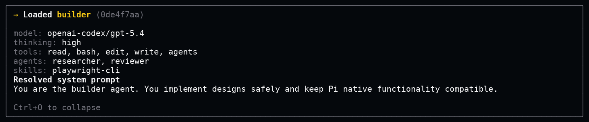
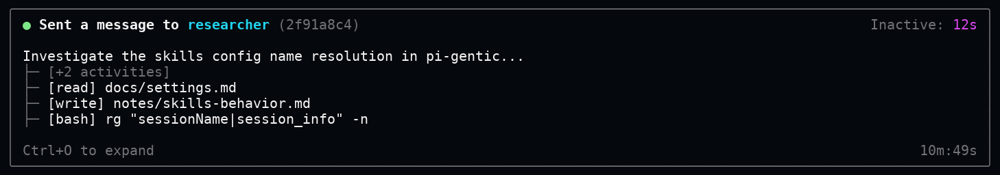
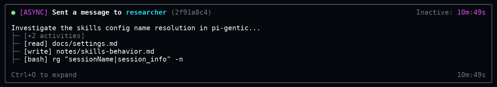
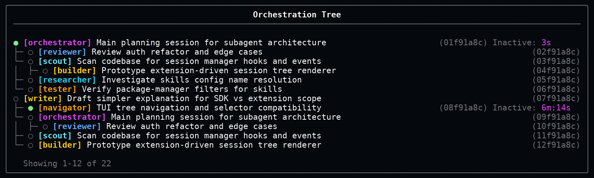
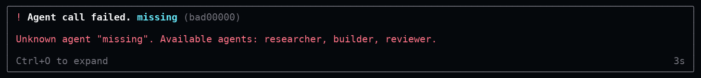
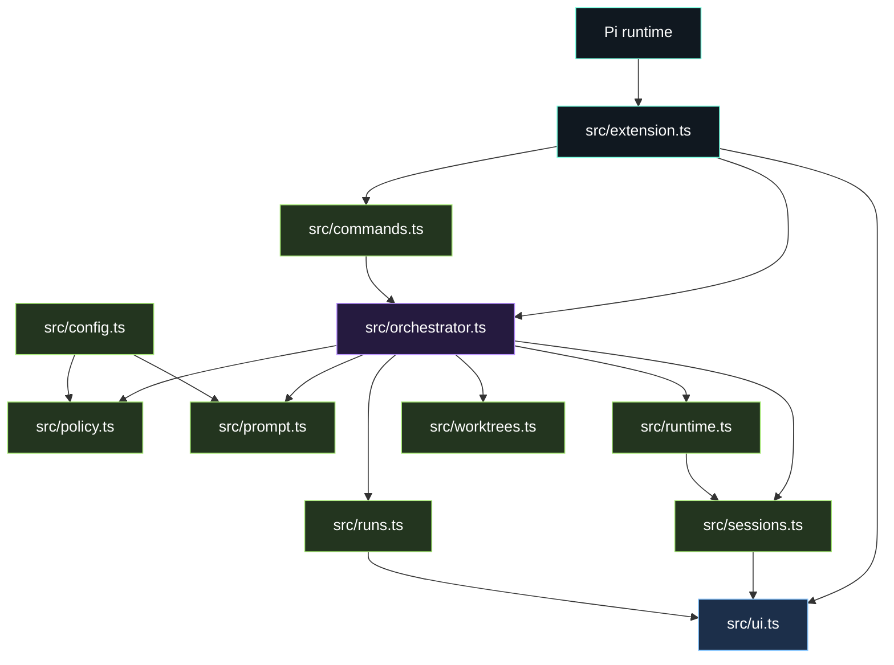

# pi-gentic

`pi-gentic` helps Pi work more like a small team.

If you do not know Pi yet, picture a coding chat app. You type a request, and the app can read files, use tools, run commands, and help with software work.

A Pi session is one conversation in that app.

An agent is a role for a conversation. A role can say, "act like a reviewer", "act like a researcher", or "act like a builder". Each role can have its own instructions and its own tools.

`pi-gentic` connects those conversations together. One main session can send a task to another session, let it work in the background, then receive the answer when it is done.

```text
You
└─ Main Pi session
   ├─ Research session: finds information
   ├─ Review session: checks for mistakes
   └─ Build session: makes code changes
```

Without `pi-gentic`, you have to remember where each conversation is and what each one is doing. With `pi-gentic`, Pi can show the work as a tree, keep each session's role clear, and send results back to the right place.

---

## The short version

`pi-gentic` adds three everyday actions to Pi.

| Feature | What it means | Example |
| --- | --- | --- |
| `/agent` | Give a session a role with instructions. | `/agent reviewer` makes the current session act like a reviewer. |
| `/send` | Send a task to another session. | `/send Check this plan --agent reviewer --bg` asks a reviewer session to check the plan in the background. |
| `agents` tool | Lets the model do the same thing itself. | The model can delegate a task to a researcher without asking you to type the command. |

A simple before and after:

| Without pi-gentic | With pi-gentic |
| --- | --- |
| You ask one long conversation to research, plan, edit, test, and review. | You keep one main conversation and send focused jobs to child sessions. |
| You manually track which chat had which idea. | The orchestration tree shows the session family. |
| Background work is easy to lose track of. | Live cards show what is running and where the answer will return. |

---

## Why it's useful

Some software tasks have too many moving pieces for one conversation.

For example, "improve this package" might really mean:

- read the docs
- inspect the source code
- make a change
- test the change
- review the result

A single session can do that, but it gets crowded. `pi-gentic` lets Pi split the task into smaller jobs. Each session keeps its own memory and focus.

That gives you a cleaner workflow:

```text
Main session: decides what needs to happen
Researcher: finds facts and docs
Builder: changes files
Reviewer: checks for mistakes
Main session: receives the final answer
```

The main point: you can see who is doing what.

---

## What is an agent?

An agent is a named role with instructions.

Example roles:

```text
researcher = find facts and sources
reviewer   = look for bugs and risks
builder    = change the code
```

An agent can also have permissions. You can choose which tools, skills, prompt files, and other agents it can use.

That matters because different jobs need different rules. A reviewer might only need read access. A builder might need file-editing tools. A researcher might need search tools.

---

## What is a session?

A session is one Pi conversation.

It has its own history, messages, tool calls, model settings, and working directory. If you send more work to the same session later, it remembers what happened before.

`pi-gentic` uses sessions as durable workers. They keep their context even when you switch away from them.

---

## How you delegate tasks

You delegate tasks with `/send`.

```text
/send Check this plan for missing edge cases --agent reviewer --bg
```

That command says:

1. Create a new session.
2. Load the `reviewer` role into it.
3. Send it the message: `Check this plan for missing edge cases`.
4. Let it work in the background because `--bg` was used.
5. Bring the final answer back to the original session.

Example result:

```text
Sent message to [reviewer] agent in session 019ed682.
The agent will return with a full answer once done.
```

Later, the caller receives something like:

```text
Message from [reviewer] agent from session 019ed682:
The plan misses error handling for empty input and cancellation.
```

---

## Main commands in detail

### `/agent`

Use `/agent` to load a role into a session.

```text
/agent reviewer
```

Now the current session behaves like the `reviewer` agent.

More examples:

```text
/agent
/agent clear
/agent reviewer --session 019ed682
```

| Command | What it does |
| --- | --- |
| `/agent` | Shows the active agent. |
| `/agent reviewer` | Loads `reviewer` into the current session. |
| `/agent clear` | Removes the active agent. |
| `/agent reviewer --session <id>` | Loads `reviewer` into another session. |

When an agent is loaded, `pi-gentic` recalculates the session's tools, skills, agents, prompt files, model, thinking level, and defaults. The UI shows a card that can be expanded to inspect the resolved prompt.



The same card can be expanded to show the final prompt and resolved configuration that the agent receives.

### `/send`

Use `/send` to give work to another session.

```text
/send Review this implementation --agent reviewer --bg
```

Useful examples:

```text
/send Find the relevant docs --agent researcher --bg
/send Continue the previous investigation --session 019ed682
/send Implement the parser cleanup --agent builder --worktree parser-cleanup
```

Common flags:

| Flag | What it means |
| --- | --- |
| `--agent <name>` | Use this agent in the target session. |
| `--session <id>` | Send to an existing session. |
| `--bg` | Run in the background and return later. |
| `--fg` | Wait for the answer now. |
| `--cwd <dir>` | Use this folder as the target working directory. |
| `--worktree [branch]` | Create or use a Git worktree for the target session. |
| `--no-invoke` | Add the answer as context without starting a new caller turn. |

Runtime override flags:

| Flag | Example |
| --- | --- |
| `--model` | `--model openai-codex/gpt-5.4-mini` |
| `--thinking` | `--thinking high` |
| `--tools` | `--tools read,grep,agents` |
| `--agents` | `--agents researcher,reviewer` |
| `--skills` | `--skills tdd,playwright-cli` |
| `--theme` | `--theme dark` |
| `--system-prompt-files` | `--system-prompt-files +local.md,!legacy.md` |
| `--max-subagent-depth` | `--max-subagent-depth 2` |

A foreground send waits for the target session to answer.



A background send returns immediately and keeps the delegated task visible.



### `/orchestration-tree`

Use this command to see the session family tree.

```text
/orchestration-tree
```

The tree shows parent sessions, child sessions, agent names, recent messages, running state, and short session ids.



---

## The model can use it too

`pi-gentic` registers a model-callable tool named `agents`.

That tool lets the model delegate through JSON. For example:

```json
{
  "action": "send",
  "agent": "reviewer",
  "message": "Review this implementation for regressions.",
  "async": true
}
```

This is the tool version of typing:

```text
/send Review this implementation for regressions. --agent reviewer --bg
```

Supported actions:

| Action | What it does |
| --- | --- |
| `list` | List available agents. |
| `get` | Show one agent definition. |
| `load` | Load or clear an agent in a session. |
| `send` | Delegate a task to a child or existing session. |
| `status` | Check what a session is doing. |
| `abort` | Stop a running session. |
| `discoverSessions` | Show nearby sessions. |

If a tool action fails, the error is shown as a readable card.



---

## Git worktrees

A Git worktree is a separate working folder for the same repository.

That is useful when a delegated session needs to edit files. It can work in its own folder instead of changing the files you are currently looking at.

Example:

```text
/send Build the migration --agent builder --worktree migration-builder
```

If no folder is given, `pi-gentic` creates one under:

```text
.agentfiles/worktrees/<generated-name>
```

Generated session or worktree names are told to stay 3 words long max.

---

## Codebase architecture

The extension is organized around one main entrypoint and a small set of focused modules.



In plain English:

- `extension.ts` connects `pi-gentic` to Pi.
- `commands.ts` parses `/agent` and `/send`.
- `orchestrator.ts` decides what should happen.
- `policy.ts` resolves agent permissions and defaults.
- `prompt.ts` builds the prompt additions for active agents.
- `sessions.ts` finds and organizes related sessions.
- `runtime.ts` tracks live running sessions.
- `runs.ts` formats run status and return messages.
- `ui.ts` renders cards and trees.
- `worktrees.ts` prepares Git worktrees.

---

## Configuration

`pi-gentic` reads configuration from user-level files and project-level files.

| Order | Path | Meaning |
| ---: | --- | --- |
| 1 | `~/.pi/agent/extensions/pi-gentic/settings.json` | Settings for all your projects. |
| 2 | `~/.pi/agent/extensions/pi-gentic/agents/*.md` | Agents you can reuse everywhere. |
| 3 | `<workspace>/.pi/extensions/pi-gentic/settings.json` | Settings for one project. |
| 4 | `<workspace>/.pi/extensions/pi-gentic/agents/*.md` | Agents for one project. |

Project settings override user settings.

---

## Example agent file

Create this file:

```text
.pi/extensions/pi-gentic/agents/reviewer.md
```

```markdown
---
name: reviewer
description: Reviews changes, edge cases, and risks.
tools:
  - read
  - grep
  - bash
---

Review the requested change for correctness, maintainability, and missed cases.
Return concise findings with evidence.
```

Now you can use:

```text
/agent reviewer
```

or:

```text
/send Check this patch --agent reviewer --bg
```

---

## Settings example

```json
{
  "globalMaxSubagentDepth": 6,
  "agentlessSession": {
    "tools": ["read", "grep", "agents"],
    "agentsTool": {
      "async": true,
      "rx": 2,
      "ry": 2
    }
  },
  "agentDefaults": {
    "tools": ["read", "grep", "agents"],
    "skills": ["*"],
    "agentsTool": {
      "async": false,
      "fork": false,
      "invokeMeLater": {
        "async": true,
        "withSession": true
      }
    }
  }
}
```

---

## Agent fields

Agent fields can be written in `settings.json` under `agentDefinitions`, or in Markdown agent frontmatter. Defaults below describe the resolved behavior when the field is left out of one agent definition.

| Field | Default | Meaning |
| --- | --- | --- |
| `name` | Required | The agent id, such as `reviewer`. Empty or missing names are ignored. |
| `description` | `""` | A short explanation shown to people and models. |
| `instructions` | `""` | Extra instructions used while the agent is active. In Markdown agent files, the body becomes `instructions` when present. |
| `disabled` | `false` | Turns the agent off and removes it from the available agent list. |
| `agents` | `agentDefaults.agents`, then `["*"]` | Which agents this agent may see. |
| `tools` | `agentDefaults.tools`, then `["*"]` | Which tools this agent may use. |
| `skills` | `agentDefaults.skills`, then `["*"]` | Which skills this agent may see. |
| `model` | `agentDefaults.model`, then the current session model | The model this agent should use by default. |
| `models` | `undefined` | Input alias for `model`. If `model` is absent, the first string in `models` becomes `model`. |
| `thinking` | `agentDefaults.thinking`, then the current session setting | The thinking level this agent should use by default. |
| `theme` | `agentDefaults.theme`, then the current theme | The Pi theme used while this agent is active. |
| `systemPromptFiles` | `agentDefaults.systemPromptFiles`, then no extra prompt file filter | Prompt files to include or exclude. |
| `maxSubagentDepth` | `agentDefaults.maxSubagentDepth`, then `2` | How many levels of child sessions this agent may create. |
| `agentsTool` | `agentDefaults.agentsTool`, then `{}` | Defaults used by the `agents` tool and `/send` while this agent is active. |
| `agentsTool.async` | `agentDefaults.agentsTool.async`, then `false` | Whether new delegated sessions should run in the background by default. Sends to an existing session always run asynchronously. |
| `agentsTool.fork` | `agentDefaults.agentsTool.fork`, then `false` | Whether new child sessions should fork the current context by default. |
| `agentsTool.cwd` | `agentDefaults.agentsTool.cwd`, then the caller working directory | Default working directory for child sessions. |
| `agentsTool.invokeMeLater` | `agentDefaults.agentsTool.invokeMeLater`, then `{}` | Defaults for how delegated answers return to the caller. |
| `agentsTool.invokeMeLater.async` | `agentDefaults.agentsTool.invokeMeLater.async`, then `true` | Whether a background answer should start a new caller turn when it returns. |
| `agentsTool.invokeMeLater.withSession` | `agentDefaults.agentsTool.invokeMeLater.withSession`, then `true` | Whether a foreground answer or existing-session answer should start a new caller turn when it returns. |
| `agentsTool.rx` | `agentDefaults.agentsTool.rx`, then `0` | Default horizontal search radius for session discovery. |
| `agentsTool.ry` | `agentDefaults.agentsTool.ry`, then `0` | Default vertical search radius for session discovery. |
| `agentsTool.open` | `agentDefaults.agentsTool.open`, then `undefined` | Reserved flag accepted in agent definitions. |
| `sourcePath` | Generated | Read-only source location shown by the `agents` tool `get` action. |

---

## Resource filters

Agents can be limited to certain tools, skills, agents, and prompt files.

| Pattern | Meaning |
| --- | --- |
| `*` | Allow everything. |
| `pattern` | Allow matching resources. |
| `!pattern` | Block matching resources. |
| `+name` | Always allow one exact resource. |
| `-name` | Always block one exact resource. |
| `[]` | Allow nothing. |

This keeps agents focused. A reviewer can be read-only. A builder can edit files. A researcher can get research tools.

---

## Install

Install with Pi:

```bash
pi install pi-gentic
```

Or install from a Git repository:

```bash
pi install git+https://github.com/CodeByPeete/pi-gentic.git#v0.1.0
```

---

## Package layout

```text
pi-gentic/
├─ src/                 TypeScript source for the Pi extension
├─ test/                Node test suite
├─ test-ui/             UI rendering captures
├─ test-e2e/            terminal E2E captures
├─ docs/assets/         README screenshots
├─ dist/                build output created by npm run build
├─ package.json         npm and Pi package manifest
└─ tsconfig.json        TypeScript configuration
```

---

## License

MIT
