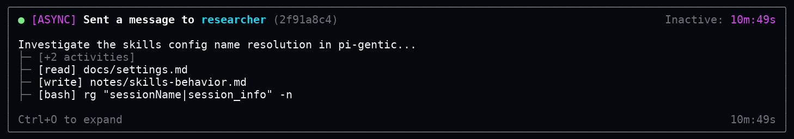
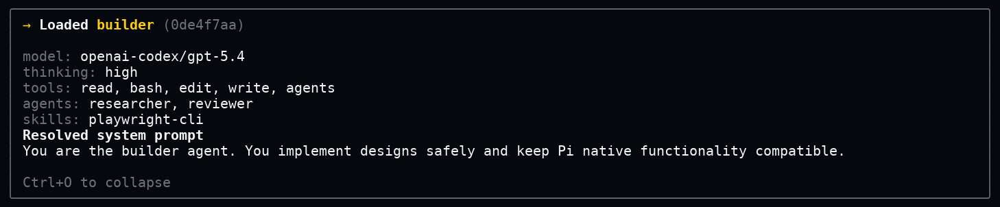
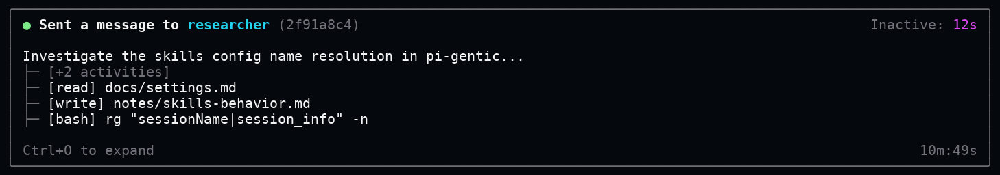
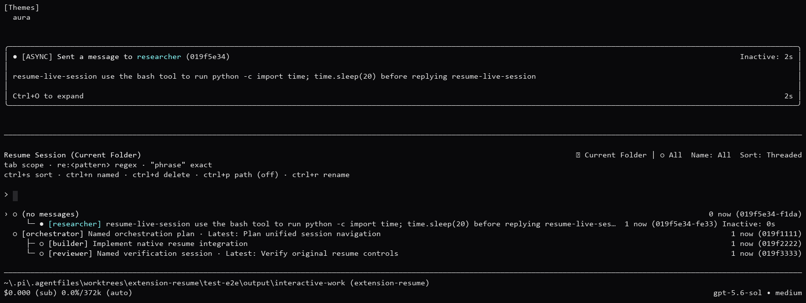
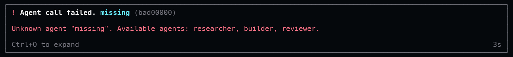
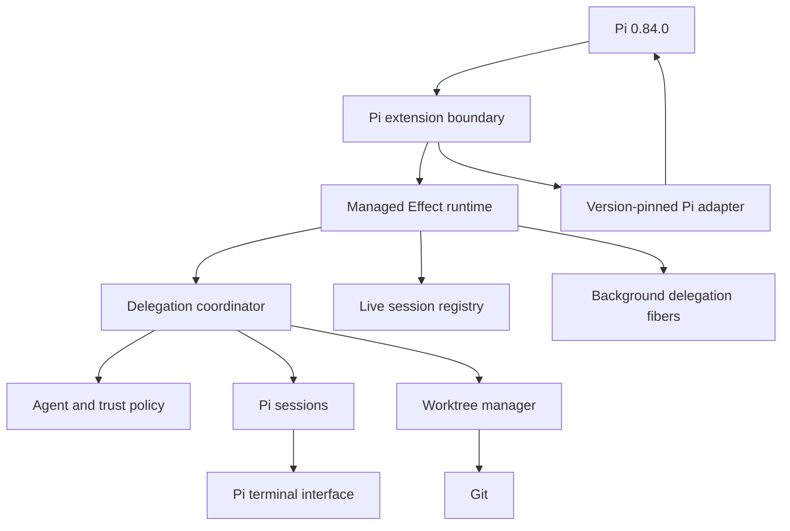

# pi-gentic

`pi-gentic` lets one Pi conversation hand focused jobs to other Pi conversations.

If Pi is new to you, picture a chat app that can read files, run commands, and help with software work. Pi calls each saved conversation a **session**. Pi-gentic lets those sessions work together.

```text
You
└─ Main Pi session
   ├─ Research session: finds information
   ├─ Review session: checks the work
   └─ Build session: changes files
```

Each session keeps its own conversation history. The main session can send work, continue immediately, and receive the result later.

## Requirements

This release requires:

- Pi `0.84.0`
- Node.js `22.19.0` or newer
- Git when you want delegated sessions to use separate work folders

Pi-gentic checks the installed Pi version when it starts. It shows a compatibility error if the version or a required Pi feature does not match.

> Pi packages can run commands and access files. Review third-party packages before installing them.

## Install

Install the published package:

```bash
pi install npm:pi-gentic@0.4.0
```

Or install the matching Git release:

```bash
pi install git:github.com/CodeByPeete/pi-gentic@v0.4.0
```

Start Pi after installation. If Pi is already open, restart it so the extension can load.

## Try it in five minutes

Pi-gentic needs at least one named role before commands such as `/agent reviewer` can use it. A role is called an **agent**.

Create this file:

```text
~/.pi/agent/extensions/pi-gentic/agents/reviewer.md
```

Add:

```markdown
---
name: reviewer
description: Checks work for mistakes, missed cases, and unclear wording.
tools:
  - read
  - grep
---

Review the requested work. Explain each problem clearly and include evidence.
```

Start a new Pi session, then load the role:

```text
/agent reviewer
```

Return to an unassigned role if you want the main session to coordinate the work:

```text
/agent clear
```

Send a review job in the background:

```text
/send Check the README for unclear instructions --agent reviewer --bg
```

Pi shows a live card while the other session works. Its final answer returns to the session that sent the request.



## What pi-gentic adds

| Feature | In plain language | Example |
| --- | --- | --- |
| `/agent` | Give a session a named role. | `/agent reviewer` |
| `/send` | Send work to another session. | `/send Check this plan --agent reviewer --bg` |
| `/resume` details | Add role, activity, and family information to Pi's session picker. | `/resume` |
| `agents` tool | Let the model use the same features itself. | The model can send work to a reviewer. |

Pi-gentic also adds `/skill <name> [request]` as a manual way to use a Pi skill. Pi's own `/skill:<name>` command continues to work.

## A few useful terms

### Agent

An agent is a named role with instructions and optional limits.

Examples:

```text
researcher = finds facts and sources
reviewer   = checks for mistakes
builder    = changes files
```

A role can choose which tools, skills, other agents, model, and display theme the session may use.

### Session

A session is one saved Pi conversation. It has its own messages, settings, working folder, and history.

Pi-gentic treats sessions as durable collaborators. Sending another job to the same session continues its existing conversation.

### Delegation

A delegation is one request sent from one session to another. The sending session is the caller. The receiving session is the target.

### Worktree

A Git worktree is a separate work folder connected to the same repository. It lets another session edit a branch without changing the files in your current folder.

## `/agent` command

Use `/agent` to inspect or change a session's role.

```text
/agent
/agent reviewer
/agent clear
/agent reviewer --session 019ed682
/agent clear --session 019ed682
```

| Command | Result |
| --- | --- |
| `/agent` | Shows the current role. |
| `/agent reviewer` | Loads `reviewer` in the current session. |
| `/agent clear` | Clears the current role. |
| `/agent reviewer --session <id>` | Loads `reviewer` in another session. |
| `/agent clear --session <id>` | Clears the role in another session. |

Press `F7` to cycle through the unassigned state and the available agents.

The role selection is saved with the session. Loading a role also applies its instructions and settings. The result card can be expanded to inspect what was applied.



## `/send` command

Use `/send` to give work to a different session.

```text
/send Review this implementation --agent reviewer --bg
```

When `--session` is absent, pi-gentic creates a child session. When `--session` is present, it continues that existing session. A session cannot send a message to itself.

### Common examples

```text
/send Find the relevant documentation --agent researcher --bg
/send Continue the previous investigation --session 019ed682
/send Check this now --agent reviewer --fg
/send Build the parser cleanup --agent builder --worktree parser-cleanup
/send Continue on a copy of this conversation --agent reviewer --fork
```

### Common options

| Option | Meaning |
| --- | --- |
| `--agent <name>` | Load this role in the target session. |
| `--session <id>` | Continue an existing session. Short unique IDs are accepted. |
| `--bg` | Continue the caller immediately and return the result later. |
| `--fg` | Wait for a new child session to finish. |
| `--fork` | Copy the caller's completed earlier conversation. The current request is replaced by the child's assignment. |
| `--no-invoke` | Detach the request. Its result stays in the caller session without starting another response or holding an enclosing delegation open. |
| `--cwd <folder>` | Set the target session's working folder. With `--worktree`, this is the requested worktree destination. |
| `--worktree [branch]` | Create or reuse a Git worktree. The branch name may be omitted. |
| `--repo <folder>` | Choose the source repository for a worktree. |

Messages sent to an existing session always run in the background because that session may already be working. For a new child, foreground is the default unless the active settings say otherwise.

A foreground send keeps its card open until the target finishes.



A background send returns control immediately.

Background requests that start another response remain joined to their caller. If an agent finishes its current response while joined work is running, its enclosing delegation stays open. Each result resumes its immediate caller, and the final response continues upward after all joined work has finished. `--no-invoke` explicitly detaches a request from this completion chain.


### One-request overrides

These options change the target for one request:

| Option | Example |
| --- | --- |
| `--model` | `--model provider/model-id` |
| `--thinking` | `--thinking high` |
| `--tools` | `--tools read,grep,agents` |
| `--agents` | `--agents researcher,reviewer` |
| `--skills` | `--skills code-review,tdd` |
| `--theme` | `--theme dark` |
| `--system-prompt-files` | `--system-prompt-files +local.md,!legacy.md` |
| `--max-subagent-depth` | `--max-subagent-depth 2` |

## `/resume` session picker

`/resume` is Pi's built-in session picker. Pi-gentic keeps the picker and adds:

- agent names
- running state
- time since the last activity
- short session IDs
- parent and child relationships

Pi's search, sorting, path display, named-session filter, rename, delete, and session-switching behavior remain available.

Pi-gentic uses a fast initial list for large session folders, then fills in more details without blocking the picker.



## `/skill` command

Pi already provides `/skill:<name>`. Pi-gentic also accepts this form:

```text
/skill code-review Check the current branch
```

The command finds the named Pi skill and sends its instructions and your request to the current session. Set `enableSkillCommands` to `false` in Pi's normal settings if you want to disable manual skill commands.

## The `agents` tool

Pi-gentic registers a tool named `agents`. The model can use it without asking you to type `/agent` or `/send`.

Example:

```json
{
  "action": "send",
  "agent": "reviewer",
  "message": "Review this implementation for regressions.",
  "async": true
}
```

This has the same purpose as:

```text
/send Review this implementation for regressions. --agent reviewer --bg
```

| Action | Result |
| --- | --- |
| `list` | Lists the agents available to the current session. |
| `get` | Shows one agent definition. Requires `agent`. |
| `load` | Loads an agent in the current session. Use `clear` as the agent name to clear it. |
| `send` | Sends work to a new child or an existing session. Requires `message`. |
| `status` | Shows what one session is doing. Requires `sessionId`. |
| `abort` | Stops the current run or a run in the supplied `sessionId`. |
| `discoverSessions` | Finds nearby sessions in the current session family. |

A failed action is shown as a readable error card.



## Git worktrees

Use a worktree when another session needs to edit files while you continue working in the current folder.

```text
/send Build the migration --agent builder --worktree migration-builder
```

When no destination is supplied, pi-gentic creates the worktree under:

```text
<repository>/.agentfiles/worktrees/
```

An explicit destination must stay inside the selected repository. Pi-gentic rejects the repository root, Git's internal folder, path escapes through links or junctions, and folders that Git does not recognize as a worktree for that repository.

If the requested branch exists, pi-gentic uses it. Otherwise, it creates the branch from the current `HEAD`.

## Configuration locations

Pi-gentic reads its own settings and agent files from these locations:

| Priority | Path | Scope |
| ---: | --- | --- |
| 1 | `~/.pi/agent/extensions/pi-gentic/settings.json` | All projects |
| 2 | `~/.pi/agent/extensions/pi-gentic/agents/*.md` | All projects |
| 3 | `<workspace>/.pi/extensions/pi-gentic/settings.json` | One trusted project |
| 4 | `<workspace>/.pi/extensions/pi-gentic/agents/*.md` | One trusted project |

The trusted project's values are applied after the user-level values, so they can override them. Pi-gentic reads project files only when Pi reports that the project is trusted. User-level configuration remains available in untrusted projects.

Extra instruction files must stay inside a trusted pi-gentic configuration folder. Files that escape through a link or an outside path are ignored and reported.

## Settings example

This example gives unassigned sessions a small tool set and lets named agents see all configured skills:

```json
{
  "globalMaxSubagentDepth": 6,
  "sessionMessagingScope": "tree",
  "agentlessSession": {
    "tools": ["read", "grep", "agents"]
  },
  "agentDefaults": {
    "tools": ["read", "grep", "agents"],
    "skills": ["*"],
    "agentsTool": {
      "async": false,
      "fork": false,
      "invokeMeLater": {
        "async": true,
        "withSession": true
      }
    }
  }
}
```

### Main setting groups

| Setting | Default | Meaning |
| --- | --- | --- |
| `defaultAgent` | none | Role loaded in a new blank session. Use `null` to disable it. |
| `globalMaxSubagentDepth` | `6` | Deepest allowed child-session level, with the first session at level `0`. |
| `sessionMessagingScope` | `"tree"` | Existing-session sends stay in the same session family. Use `"all"` to allow any visible session. |
| `agentlessSession` | `{}` | Settings used when the current session has no named role. |
| `agentDefaults` | `{}` | Defaults shared by named agents. |
| `agentDefinitions` | `[]` | Agent definitions written directly in JSON. Markdown files are also supported. |

## Agent file reference

An agent can be written in Markdown frontmatter or inside `agentDefinitions` in `settings.json`.

```markdown
---
name: reviewer
description: Reviews changes, edge cases, and risks.
tools:
  - read
  - grep
agents:
  - researcher
maxSubagentDepth: 1
---

Review the requested change for correctness and missed cases.
Return concise findings with evidence.
```

### Agent fields

| Field | Default | Meaning |
| --- | --- | --- |
| `name` | required | Agent ID, such as `reviewer`. Empty or missing names are ignored. |
| `description` | `""` | Short explanation shown to people and the model. |
| `instructions` | `""` | Instructions added while the agent is active. A Markdown file's body becomes the instructions. |
| `disabled` | `false` | Hides the agent when set to `true`. |
| `agents` | inherited, then `["*"]` | Agents this session may see. |
| `tools` | inherited, then `["*"]` | Tools this session may use. |
| `skills` | inherited, then `["*"]` | Skills this session may see. |
| `model` | inherited, then current model | Model used by the session. |
| `models` | none | Input alias for `model`. The first string is used when `model` is absent. |
| `thinking` | inherited, then current setting | Thinking level used by the session. |
| `theme` | inherited, then current theme | Pi display theme used by the session. |
| `systemPromptFiles` | none | Extra instruction files to include or exclude. |
| `maxSubagentDepth` | inherited, then `1` | Number of child levels this session may create. `0` blocks new children. |
| `agentsTool` | inherited, then `{}` | Default behavior for the `agents` tool and `/send`. |
| `sourcePath` | generated | Read-only source location shown by the `get` action. |

### `agentsTool` fields

| Field | Default | Meaning |
| --- | --- | --- |
| `async` | `false` | New child sends use the background by default. Existing-session sends always use the background. |
| `fork` | `false` | New children copy the caller's completed earlier conversation by default. The current request is replaced by the child's assignment. |
| `cwd` | caller's folder | Default working folder for a child session. |
| `invokeMeLater.async` | `true` | A background result may start a new caller response and remains joined to an enclosing delegation. |
| `invokeMeLater.withSession` | `true` | A deferred foreground result may continue the caller and remains joined to an enclosing delegation. |
| `rx` | `0` | Default horizontal distance for `discoverSessions`. |
| `ry` | `0` | Default vertical distance for `discoverSessions`. |
| `open` | none | Reserved setting. It is accepted but currently has no effect. |

## Child-session limits

`globalMaxSubagentDepth` is the absolute limit for the whole session family. The first session is at level `0`.

`maxSubagentDepth` is the local child allowance for one session. A value of `1` lets that session create a direct child. A value of `0` blocks new children.

Sending to an existing session does not create a child and does not use this allowance.

## Resource filters

Agents can limit the tools, skills, agents, and extra instruction files they use.

| Pattern | Meaning |
| --- | --- |
| `*` | Keep every item currently available. |
| `name` | Keep the matching name. |
| `prefix-*` | Keep names that match the wildcard pattern. |
| `!pattern` | Remove matching names. |
| `+name` | Add one exact registered name. |
| `-name` | Remove one exact name, even if another rule adds it. |
| `[]` | Allow none. |

For tools, `*`, exclusions, and exact additions start from Pi's current active tool selection. A plain inclusion list selects from Pi's registered tools. Pi-gentic remembers the active selection it observed before applying a narrower agent policy and restores it when the restriction is cleared, unless Pi or another extension has supplied a newer selection.

Examples:

```json
{ "tools": ["*"] }
{ "tools": ["*", "!bash"] }
{ "tools": ["read", "grep", "+agents"] }
{ "tools": [] }
```

## Privacy and local data

Pi-gentic stores its state through Pi's session files and configuration folders. It does not send its own telemetry to an outside service.

Delegated prompts and answers become part of the relevant Pi sessions. Error reports can include local file paths and messages needed to explain a failure. Protect your Pi session and configuration folders as you would protect the project itself.

## For maintainers

### Runtime design

Pi owns conversations, models, tools, trust decisions, prompts, and terminal behavior. Pi-gentic adds role policy, session coordination, worktree handling, and presentation around those Pi features.


```mermaid
flowchart TD
    Pi[Pi 0.84.0] --> Boundary[Pi extension boundary]
    Boundary --> Runtime[Managed Effect runtime]
    Runtime --> Coordinator[Delegation coordinator]
    Runtime --> Registry[Live session registry]
    Runtime --> Fibers[Background delegation fibers]
    Coordinator --> Policy[Agent and trust policy]
    Coordinator --> Sessions[Pi sessions]
    Coordinator --> Worktrees[Worktree manager]
    Worktrees --> Git[Git]
    Sessions --> UI[Pi terminal interface]
    Boundary --> Adapter[Version-pinned Pi adapter]
    Adapter --> Pi
```

One managed runtime belongs to the loaded extension. It owns background work, live updates, timers, process streams, and cleanup. Unknown data from Pi, processes, configuration, and saved cards is checked at its boundary. Long-running cards keep the latest 100 activities and the exact number of hidden activities.

The remaining private Pi integration is kept in one version-pinned adapter and guarded by compatibility tests. See the [host-contract decision](docs/adr/0002-pi-host-contract.md) and [Effect feature ledger](docs/effect-feature-ledger.md) for the detailed design record.

### Development

Install requirements with:

```bash
npm ci
```

The installation prepares the local Effect source used by the stricter checks. Common commands are:

```bash
npm run check
npm run test:integration
npm run test:compat
npm run test:coverage
npm run test:coverage:effect
npm run test:ui
npm run test:e2e
```

`npm run test:e2e` uses deterministic fixtures and does not call a live model. `npm run test:e2e:live` is optional and may call the configured model. Fresh visual output is written under `test-ui/output` and `test-e2e/output`.

### Release publishing

Publishing a GitHub release starts `.github/workflows/publish-npm.yml`. The workflow runs the full checks, verifies that the `v<version>` tag matches `package.json`, and publishes only when that version is absent from npm.

The npm trusted publisher can be configured with:

```bash
npx --yes npm@latest trust github pi-gentic --repo CodeByPeete/pi-gentic --file publish-npm.yml --allow-publish --yes
```

Release steps:

1. Update the version in `package.json` and `package-lock.json`.
2. Run all checks and inspect the fresh visual evidence.
3. Merge and push the prepared commit to `main`.
4. Create a GitHub release tagged `v<version>` from that commit.
5. Publish the GitHub release when the package should be sent to npm.

### Package layout

```text
pi-gentic/
├─ .github/workflows/   checks and npm publishing
├─ docs/                design records and README images
├─ scripts/             repeatable setup helpers
├─ src/                 extension source
├─ test/                main automated checks
├─ test-effect/         Effect-focused checks
├─ test-ui/             terminal component captures
├─ test-e2e/            full terminal-flow captures
├─ package.json         package details and commands
└─ tsconfig.json        TypeScript settings
```

## License

MIT
